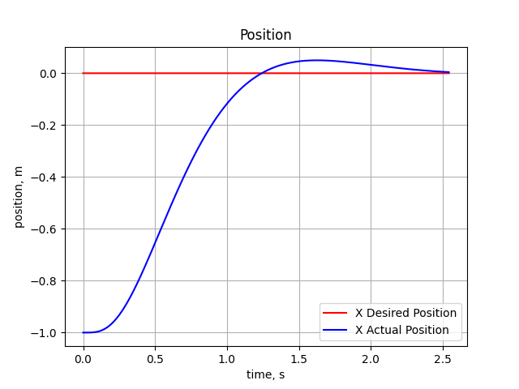

## quadrotor planning, state estimation, control

This project implements a comprehensive system for quadrotor autonomy, including state estimation, path planning, trajectory optimization, and control, all developed from the ground up.

### Planning

- Utilized A* algorithm with engineering optimizations:
  - Diagonal heuristic
  - Cross tie breaker
- Achieved 20x planning speed improvement in 3D grid maps
- Future improvements:
  - Integration of dynamic model with state-space planning (e.g., State Lattice Search, Kinodynamic RRT*, Hybrid A*)

- Implemented minimum snap trajectory optimization
- Based on paths generated by A* algorithm
- Solves kinodynamic constraints with boundary conditions in Cartesian space

### UKF

- Implemented quaternion-based Unscented Kalman Filter (UKF) and complementary filter
- Achieved 20% improved efficiency compared to rotation matrix implementations
- Deployed complementary filter on onboard IMU due to computational resource constraints

Esitmation results of the quadrotor:

Gound truth:

### Control
- Developed custom control algorithms for quadrotor stabilization and trajectory following
- Utilized PID controllers for attitude and position control. 

Orientation:

Position:

Commands:
